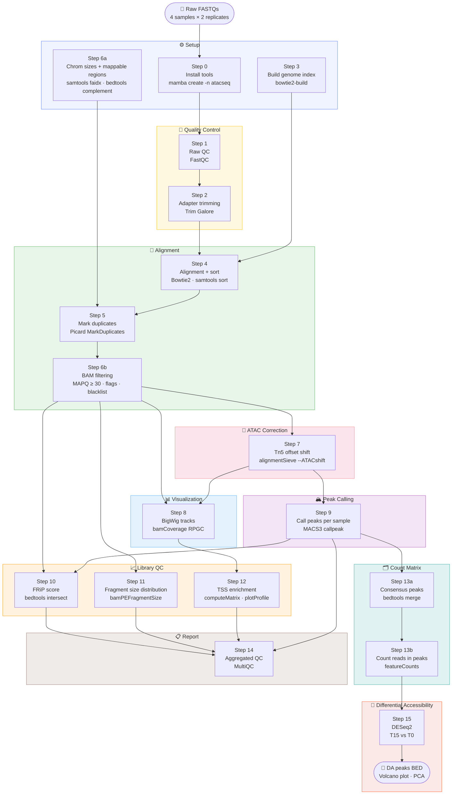

# ATAC-seq Step-by-Step Tutorial

**Author:** Quynh Nhu Nguyen

**Google Colab notebook:** [Run this tutorial interactively on Google Colab](https://colab.research.google.com/drive/17OkM7skvwqHQUWW6NFZKqktr6qKFzVtx#scrollTo=APWQ9nlu9s1C)

This tutorial covers the full ATAC-seq analysis pipeline for paired-end data, from raw reads to called peaks, processing all four samples.

---

## Data

| Sample | Replicate | R1 | R2 |
|---|---|---|---|
| OSMOTIC_STRESS_T0_PE | rep1 | `raw/SRR1822153_1.fastq.gz` | `raw/SRR1822153_2.fastq.gz` |
| OSMOTIC_STRESS_T0_PE | rep2 | `raw/SRR1822154_1.fastq.gz` | `raw/SRR1822154_2.fastq.gz` |
| OSMOTIC_STRESS_T15_PE | rep1 | `raw/SRR1822157_1.fastq.gz` | `raw/SRR1822157_2.fastq.gz` |
| OSMOTIC_STRESS_T15_PE | rep2 | `raw/SRR1822158_1.fastq.gz` | `raw/SRR1822158_2.fastq.gz` |

**Reference files:**
- Genome FASTA: `references/genome.fa`
- Gene annotation: `references/genes.gtf`
- Blacklist: `references/ce11-blacklist.v2.bed`

---

## Step 0 — Install Tools with Mamba

### 0a. Install Mamba (if not already installed)

```bash
# Download Miniforge (includes mamba)
wget https://github.com/conda-forge/miniforge/releases/latest/download/Miniforge3-Linux-x86_64.sh
bash Miniforge3-Linux-x86_64.sh

# Restart your shell or run:
source ~/.bashrc
```

### 0b. Create environment and install all tools

```bash
mamba create -n atacseq -y \
  -c bioconda -c conda-forge \
  fastqc \
  trim-galore \
  bowtie2 \
  samtools \
  picard \
  deeptools \
  macs3 \
  bedtools \
  subread \
  multiqc \
  bc
```

### 0c. Activate the environment

```bash
conda activate atacseq
```

> You must run `conda activate atacseq` each time you open a new terminal before starting any analysis.

---

## Define All Samples

Store all sample information in bash associative arrays. Every step below loops over all four samples automatically.

```bash
declare -A R1 R2 OUTDIR

SAMPLES=(
  "OSMOTIC_STRESS_T0_PE_rep1"
  "OSMOTIC_STRESS_T0_PE_rep2"
  "OSMOTIC_STRESS_T15_PE_rep1"
  "OSMOTIC_STRESS_T15_PE_rep2"
)

R1["OSMOTIC_STRESS_T0_PE_rep1"]="raw/SRR1822153_1.fastq.gz"
R1["OSMOTIC_STRESS_T0_PE_rep2"]="raw/SRR1822154_1.fastq.gz"
R1["OSMOTIC_STRESS_T15_PE_rep1"]="raw/SRR1822157_1.fastq.gz"
R1["OSMOTIC_STRESS_T15_PE_rep2"]="raw/SRR1822158_1.fastq.gz"

R2["OSMOTIC_STRESS_T0_PE_rep1"]="raw/SRR1822153_2.fastq.gz"
R2["OSMOTIC_STRESS_T0_PE_rep2"]="raw/SRR1822154_2.fastq.gz"
R2["OSMOTIC_STRESS_T15_PE_rep1"]="raw/SRR1822157_2.fastq.gz"
R2["OSMOTIC_STRESS_T15_PE_rep2"]="raw/SRR1822158_2.fastq.gz"

OUTDIR["OSMOTIC_STRESS_T0_PE_rep1"]="results/OSMOTIC_STRESS_T0_PE"
OUTDIR["OSMOTIC_STRESS_T0_PE_rep2"]="results/OSMOTIC_STRESS_T0_PE"
OUTDIR["OSMOTIC_STRESS_T15_PE_rep1"]="results/OSMOTIC_STRESS_T15_PE"
OUTDIR["OSMOTIC_STRESS_T15_PE_rep2"]="results/OSMOTIC_STRESS_T15_PE"

REF="references/genome.fa"
INDEX="references/bowtie2_index/genome"
CHROM_SIZES="references/genome.chrom.sizes"
INCLUDE_BED="references/genome.include.bed"
```

### Create output directories for all samples

```bash
for SAMPLE in "${SAMPLES[@]}"; do
  mkdir -p "${OUTDIR[$SAMPLE]}/{fastqc,trimmed,aligned,filtered,peaks,bigwig}"
done
```

---

## Step 1 — Raw Read Quality Control (FastQC)

```bash
for SAMPLE in "${SAMPLES[@]}"; do
  echo "=== FastQC: ${SAMPLE} ==="
  fastqc \
    --threads 2 \
    --outdir "${OUTDIR[$SAMPLE]}/fastqc" \
    "${R1[$SAMPLE]}" "${R2[$SAMPLE]}"
done
```

**What to check:**
- Per-base sequence quality (should be > Q30)
- Adapter content (Nextera adapters are expected in ATAC-seq libraries)
- GC content distribution

---

## Step 2 — Adapter and Quality Trimming (Trim Galore)

ATAC-seq libraries often have high adapter contamination due to short insert sizes.

```bash
for SAMPLE in "${SAMPLES[@]}"; do
  echo "=== Trim Galore: ${SAMPLE} ==="
  trim_galore \
    --paired \
    --gzip \
    --cores 4 \
    --fastqc \
    --output_dir "${OUTDIR[$SAMPLE]}/trimmed" \
    "${R1[$SAMPLE]}" "${R2[$SAMPLE]}"
done
```

**Key parameters:**
- `--fastqc`: Automatically run FastQC on trimmed output

---

## Step 3 — Build Genome Index (once per genome)

```bash
mkdir -p references/bowtie2_index

bowtie2-build \
  --threads 8 \
  "${REF}" \
  "${INDEX}"
```

---

## Step 4 — Read Alignment (Bowtie2)

```bash
for SAMPLE in "${SAMPLES[@]}"; do
  echo "=== Alignment: ${SAMPLE} ==="

  # Trim Galore names output files as: *_val_1.fq.gz / *_val_2.fq.gz
  BASE_R1=$(basename "${R1[$SAMPLE]}" .fastq.gz)
  BASE_R2=$(basename "${R2[$SAMPLE]}" .fastq.gz)
  TRIMMED_R1="${OUTDIR[$SAMPLE]}/trimmed/${BASE_R1}_val_1.fq.gz"
  TRIMMED_R2="${OUTDIR[$SAMPLE]}/trimmed/${BASE_R2}_val_2.fq.gz"

  bowtie2 \
    --very-sensitive \
    --no-discordant \
    -X 2000 \
    --threads 8 \
    -x "${INDEX}" \
    -1 "${TRIMMED_R1}" \
    -2 "${TRIMMED_R2}" \
    --rg-id "${SAMPLE}" \
    --rg "SM:${SAMPLE}" \
    --rg "LB:${SAMPLE}" \
    --rg "PL:ILLUMINA" \
    2> "${OUTDIR[$SAMPLE]}/aligned/${SAMPLE}.bowtie2.log" \
  | samtools view -bS - \
  > "${OUTDIR[$SAMPLE]}/aligned/${SAMPLE}.unsorted.bam"

  samtools sort \
    --threads 4 \
    -m 4G \
    -o "${OUTDIR[$SAMPLE]}/aligned/${SAMPLE}.bam" \
    "${OUTDIR[$SAMPLE]}/aligned/${SAMPLE}.unsorted.bam"

  samtools index "${OUTDIR[$SAMPLE]}/aligned/${SAMPLE}.bam"
  rm "${OUTDIR[$SAMPLE]}/aligned/${SAMPLE}.unsorted.bam"
done
```

**Key parameters:**
- `--very-sensitive`: High-sensitivity alignment mode
- `--no-discordant`: Discard reads where mates map in unexpected orientations
- `-X 2000`: Allow insert size up to 2000 bp to capture nucleosomal fragments

---

## Step 5 — Mark Duplicates (Picard)

PCR duplicates are marked but **not removed** — ATAC-seq may have genuine reads from the same Tn5 insertion site.

```bash
for SAMPLE in "${SAMPLES[@]}"; do
  echo "=== MarkDuplicates: ${SAMPLE} ==="
  picard MarkDuplicates \
    INPUT="${OUTDIR[$SAMPLE]}/aligned/${SAMPLE}.bam" \
    OUTPUT="${OUTDIR[$SAMPLE]}/aligned/${SAMPLE}.markdup.bam" \
    METRICS_FILE="${OUTDIR[$SAMPLE]}/aligned/${SAMPLE}.markdup.metrics.txt" \
    ASSUME_SORTED=true \
    REMOVE_DUPLICATES=false \
    OPTICAL_DUPLICATE_PIXEL_DISTANCE=2500 \
    DUPLICATE_SCORING_STRATEGY=SUM_OF_BASE_QUALITIES \
    VALIDATION_STRINGENCY=LENIENT

  samtools index "${OUTDIR[$SAMPLE]}/aligned/${SAMPLE}.markdup.bam"

  # Pre-filter statistics
  samtools flagstat "${OUTDIR[$SAMPLE]}/aligned/${SAMPLE}.markdup.bam" \
    > "${OUTDIR[$SAMPLE]}/aligned/${SAMPLE}.pre-filtered.flagstat.txt"
done
```

---

## Step 6 — Filter the BAM

Remove low-quality alignments, unmapped reads, secondary alignments, and duplicates.

### 6a. Generate chromosome sizes and include regions (once per genome)

The include BED defines which chromosomes to keep. Mitochondrial reads (MT/chrM) are excluded as they are over-represented in ATAC-seq and skew the data.

```bash
CHROM_SIZES="references/genome.chrom.sizes"
INCLUDE_BED="references/genome.include.bed"

# Index FASTA, generate chrom sizes excluding MT
samtools faidx "${REF}"
cut -f1,2 "${REF}.fai" | grep -v '^MT' > "${CHROM_SIZES}"

# Convert chrom sizes to a full-genome BED (one region per chromosome)
awk 'OFS="\t" {print $1, 0, $2}' "${CHROM_SIZES}" > "${INCLUDE_BED}"
```

> **Blacklist filtering (optional):** For human/mouse data, it is recommended to also exclude ENCODE blacklist regions (repetitive or unmappable loci that generate artifactual signal). If you have a blacklist BED file, replace the `awk` line above with:
> ```bash
> bedtools subtract -a <(awk 'OFS="\t" {print $1, 0, $2}' "${CHROM_SIZES}") \
>                  -b path/to/blacklist.bed > "${INCLUDE_BED}"
> ```
> Blacklists for human (hg38) and mouse (mm10) are available from [ENCODE](https://github.com/Boyle-Lab/Blacklist).

### 6b. Filter reads for all samples

```bash
for SAMPLE in "${SAMPLES[@]}"; do
  echo "=== Filter BAM: ${SAMPLE} ==="
  samtools view \
    -b \
    -F 0x004 \
    -F 0x0008 \
    -f 0x001 \
    -F 0x0100 \
    -F 0x0400 \
    -q 30 \
    --threads 4 \
    -L "${INCLUDE_BED}" \
    "${OUTDIR[$SAMPLE]}/aligned/${SAMPLE}.markdup.bam" \
  | samtools sort --threads 4 \
      -o "${OUTDIR[$SAMPLE]}/filtered/${SAMPLE}.filtered.bam"

  samtools index "${OUTDIR[$SAMPLE]}/filtered/${SAMPLE}.filtered.bam"

  # Post-filter statistics
  samtools flagstat "${OUTDIR[$SAMPLE]}/filtered/${SAMPLE}.filtered.bam" \
    > "${OUTDIR[$SAMPLE]}/filtered/${SAMPLE}.filtered.flagstat.txt"
done
```

**Filter flags explained:**

| Flag | Meaning |
|---|---|
| `-F 0x004` | Remove unmapped reads |
| `-F 0x0008` | Remove reads with unmapped mate |
| `-f 0x001` | Keep only properly paired reads |
| `-F 0x0100` | Remove secondary alignments |
| `-F 0x0400` | Remove PCR/optical duplicates |
| `-q 30` | Keep only MAPQ ≥ 30 (high-confidence mappings) |
| `-L` | Restrict to chromosomes in include BED (excludes MT) |

---

## Step 7 — Shift Reads for Tn5 Offset

The Tn5 transposase cuts DNA and inserts adapters with a 9 bp offset: +4 bp on the forward strand and −5 bp on the reverse strand. Shifting centers the signal at the true cut site.

```bash
for SAMPLE in "${SAMPLES[@]}"; do
  echo "=== Tn5 shift: ${SAMPLE} ==="
  alignmentSieve \
    --ATACshift \
    --bam "${OUTDIR[$SAMPLE]}/filtered/${SAMPLE}.filtered.bam" \
    --outFile "${OUTDIR[$SAMPLE]}/filtered/${SAMPLE}.shifted.bam" \
    --numberOfProcessors 8

  samtools sort \
    --threads 4 \
    -o "${OUTDIR[$SAMPLE]}/filtered/${SAMPLE}.shifted.sorted.bam" \
    "${OUTDIR[$SAMPLE]}/filtered/${SAMPLE}.shifted.bam"

  samtools index "${OUTDIR[$SAMPLE]}/filtered/${SAMPLE}.shifted.sorted.bam"
  rm "${OUTDIR[$SAMPLE]}/filtered/${SAMPLE}.shifted.bam"
done
```

---

## Step 8 — Generate BigWig Coverage Tracks

Generate RPGC-normalized BigWig files for visualization in IGV or UCSC Genome Browser.

```bash
GENOME_SIZE=$(awk '{sum += $2} END {print sum}' references/genome.chrom.sizes)

for SAMPLE in "${SAMPLES[@]}"; do
  echo "=== BigWig: ${SAMPLE} ==="
  bamCoverage \
    --bam "${OUTDIR[$SAMPLE]}/filtered/${SAMPLE}.shifted.sorted.bam" \
    --outFileName "${OUTDIR[$SAMPLE]}/bigwig/${SAMPLE}.shifted.bigWig" \
    --outFileFormat bigwig \
    --binSize 10 \
    --normalizeUsing RPGC \
    --effectiveGenomeSize "${GENOME_SIZE}" \
    --numberOfProcessors 8
done
```

**RPGC normalization** scales each sample so that 1× coverage equals one read per base across the mappable genome — allows direct comparison between samples with different sequencing depths.

---

## Step 9 — Peak Calling (MACS3)

### 9a. Convert shifted BAM to BED

```bash
for SAMPLE in "${SAMPLES[@]}"; do
  echo "=== BAM to BED: ${SAMPLE} ==="
  bedtools bamtobed \
    -i "${OUTDIR[$SAMPLE]}/filtered/${SAMPLE}.shifted.sorted.bam" \
  | awk 'BEGIN{OFS="\t"} {
      if ($6 == "+") { $2 = $2 + 4 }
      else if ($6 == "-") { $3 = $3 - 5 }
      print
    }' \
  > "${OUTDIR[$SAMPLE]}/peaks/${SAMPLE}.shifted.bed"
done
```

### 9b. Call peaks

```bash
for SAMPLE in "${SAMPLES[@]}"; do
  echo "=== MACS3 callpeak: ${SAMPLE} ==="
  macs3 callpeak \
    -t "${OUTDIR[$SAMPLE]}/peaks/${SAMPLE}.shifted.bed" \
    -f BED \
    -n "${SAMPLE}" \
    --outdir "${OUTDIR[$SAMPLE]}/peaks" \
    --shift -75 \
    --extsize 150 \
    --keep-dup all \
    --nomodel \
    --call-summits \
    -q 0.01 \
    --trackline
done
```

**Key parameters:**
- `--shift -75` + `--extsize 150`: Extend each read 150 bp centered on the cut site, modeling the nucleosome-free region
- `--keep-dup all`: Keep all reads (duplicates were already removed in Step 6)
- `--nomodel`: Use the explicit shift/extsize instead of estimating from data
- `--call-summits`: Report the precise summit within each peak
- `-q 0.01`: FDR threshold of 1%

**Output:** `${OUTDIR[$SAMPLE]}/peaks/${SAMPLE}_peaks.narrowPeak`

---

## Step 10 — FRiP Score (Fraction of Reads in Peaks)

FRiP measures the signal-to-noise ratio. FRiP ≥ 20% is considered good quality for ATAC-seq.

```bash
mkdir -p results
> results/FRiP_summary.txt

for SAMPLE in "${SAMPLES[@]}"; do
  echo "=== FRiP: ${SAMPLE} ==="
  PEAKS="${OUTDIR[$SAMPLE]}/peaks/${SAMPLE}_peaks.narrowPeak"
  FILTERED_BAM="${OUTDIR[$SAMPLE]}/filtered/${SAMPLE}.filtered.bam"

  TOTAL=$(samtools view -c -F 4 "${FILTERED_BAM}")

  IN_PEAKS=$(bedtools intersect \
    -a "${FILTERED_BAM}" \
    -b "${PEAKS}" \
    -f 0.20 \
    -u \
    -ubam \
  | samtools view -c)

  FRIP=$(echo "scale=4; ${IN_PEAKS} / ${TOTAL} * 100" | bc)
  echo "  FRiP: ${FRIP}%"
  echo -e "${SAMPLE}\t${FRIP}" >> results/FRiP_summary.txt
done
```

---

## Step 11 — Fragment Size Distribution

A good ATAC-seq library shows a nucleosomal ladder pattern:
- **< 200 bp**: Nucleosome-free regions (NFR) — the most informative signal
- **~200 bp**: Mono-nucleosome fragments
- **~400 bp**: Di-nucleosome fragments

```bash
for SAMPLE in "${SAMPLES[@]}"; do
  echo "=== Fragment size: ${SAMPLE} ==="
  bamPEFragmentSize \
    --bamfiles "${OUTDIR[$SAMPLE]}/filtered/${SAMPLE}.filtered.bam" \
    --histogram "${OUTDIR[$SAMPLE]}/${SAMPLE}.fragment_size.pdf" \
    --outRawFragmentLengths "${OUTDIR[$SAMPLE]}/${SAMPLE}.fragment_size.raw.txt" \
    --binSize 10 \
    --maxFragmentLength 1500 \
    --numberOfProcessors 8
done
```

---

## Step 12 — TSS Enrichment (Advanced QC)

Signal enrichment at Transcription Start Sites (TSS) is a gold-standard quality metric for ATAC-seq. All four samples are plotted together for direct comparison.

### 12a. Extract TSS positions from GTF (once)

```bash
awk 'BEGIN{OFS="\t"} $3 == "gene" {
    if ($7 == "+") { print $1, $4-1, $4, $9, ".", $7 }
    else            { print $1, $5-1, $5, $9, ".", $7 }
  }' references/genes.gtf \
> references/genes.tss.bed
```

### 12b. Compute and plot TSS enrichment for all samples

```bash
# Collect all bigwig files
ALL_BIGWIGS=()
for SAMPLE in "${SAMPLES[@]}"; do
  ALL_BIGWIGS+=("${OUTDIR[$SAMPLE]}/bigwig/${SAMPLE}.shifted.bigWig")
done

computeMatrix reference-point \
  --referencePoint TSS \
  --scoreFileName "${ALL_BIGWIGS[@]}" \
  --regionsFileName references/genes.tss.bed \
  --upstream 2000 \
  --downstream 2000 \
  --numberOfProcessors 8 \
  --outFileName results/all_samples.tss.matrix.gz

plotProfile \
  --matrixFile results/all_samples.tss.matrix.gz \
  --outFileName results/all_samples.tss.profile.pdf \
  --plotTitle "TSS Enrichment — All Samples" \
  --perGroup

plotHeatmap \
  --matrixFile results/all_samples.tss.matrix.gz \
  --outFileName results/all_samples.tss.heatmap.pdf \
  --plotTitle "TSS Enrichment Heatmap"
```

---

## Step 13 — Consensus Peak Set and Count Matrix

When comparing multiple samples or replicates, a common peak set (consensus peaks) is required so that all samples are quantified at the same genomic regions. The resulting count matrix can be used directly for differential accessibility analysis (e.g., DESeq2, edgeR).

### 13a. Merge all peaks into a consensus peak set

```bash
mkdir -p results/consensus

# Collect all narrowPeak files
ALL_PEAKS=()
for SAMPLE in "${SAMPLES[@]}"; do
  ALL_PEAKS+=("${OUTDIR[$SAMPLE]}/peaks/${SAMPLE}_peaks.narrowPeak")
done

# Concatenate, sort, and merge overlapping peaks
cat "${ALL_PEAKS[@]}" \
  | awk 'BEGIN{OFS="\t"} {print $1, $2, $3}' \
  | sort -k1,1 -k2,2n \
  | bedtools merge -i - \
> results/consensus/consensus_peaks.bed

echo "Total consensus peaks: $(wc -l < results/consensus/consensus_peaks.bed)"
```

### 13b. (Optional) Keep peaks supported by at least 2 samples

Filtering for peaks present in ≥ 2 samples removes sample-specific noise and improves reproducibility.

```bash
# bedtools multiinter counts how many samples overlap each base
bedtools multiinter \
  -i "${ALL_PEAKS[@]}" \
  -names "${SAMPLES[@]}" \
| awk '$4 >= 2 {print $1, $2, $3}' OFS="\t" \
| bedtools merge -i - \
> results/consensus/consensus_peaks_min2.bed

echo "Peaks in ≥2 samples: $(wc -l < results/consensus/consensus_peaks_min2.bed)"
```

> Use `consensus_peaks_min2.bed` for downstream analysis when replicates are available. Use `consensus_peaks.bed` (union) when you want to retain all peaks for exploratory analysis.

### 13c. Convert consensus peaks to SAF format

featureCounts requires SAF (Simplified Annotation Format): GeneID, Chr, Start, End, Strand.

```bash
CONSENSUS="results/consensus/consensus_peaks_min2.bed"

awk 'BEGIN{OFS="\t"; print "GeneID\tChr\tStart\tEnd\tStrand"} {
    peak_id = $1 ":" $2 "-" $3
    print peak_id, $1, $2, $3, "."
  }' "${CONSENSUS}" \
> results/consensus/consensus_peaks.saf

head -3 results/consensus/consensus_peaks.saf
```

### 13d. Count reads in consensus peaks (count matrix)

featureCounts runs on all BAM files at once and outputs a single count matrix.

```bash
# Collect all filtered BAM files
ALL_BAMS=()
for SAMPLE in "${SAMPLES[@]}"; do
  ALL_BAMS+=("${OUTDIR[$SAMPLE]}/filtered/${SAMPLE}.filtered.bam")
done

featureCounts \
  -F SAF \
  -a results/consensus/consensus_peaks.saf \
  -o results/consensus/count_matrix.txt \
  -p \
  --fracOverlap 0.20 \
  -s 0 \
  -T 4 \
  "${ALL_BAMS[@]}"
```

**Key parameters:**
- `-F SAF`: Input annotation is in SAF format
- `-p`: Paired-end mode (count fragments, not reads)
- `--fracOverlap 0.20`: A fragment must overlap a peak by at least 20% to be counted
- `-s 0`: Unstranded (ATAC-seq is not strand-specific)

**Output:** `results/consensus/count_matrix.txt`

### 13e. Clean up the count matrix header

featureCounts adds the full BAM path as column headers. This step trims them to sample names.

```bash
# Build the replacement header
HEADER="GeneID\tChr\tStart\tEnd\tStrand\tLength"
for SAMPLE in "${SAMPLES[@]}"; do
  HEADER="${HEADER}\t${SAMPLE}"
done

# Replace the second header line (first line is a comment)
grep -v "^#" results/consensus/count_matrix.txt \
  | awk -v hdr="${HEADER}" 'NR==1 {print hdr; next} {print}' \
> results/consensus/count_matrix_clean.txt

echo "Count matrix dimensions: $(tail -n +2 results/consensus/count_matrix_clean.txt | wc -l) peaks x 4 samples"
```

### 13f. Extract peak counts only (for DESeq2 / edgeR)

```bash
# Columns: GeneID + one count column per sample (skip Chr, Start, End, Strand, Length)
cut -f1,7- results/consensus/count_matrix_clean.txt \
> results/consensus/count_matrix_peaks_only.txt

head -3 results/consensus/count_matrix_peaks_only.txt
```

**Output structure:**

```
GeneID                    OSMOTIC_STRESS_T0_PE_rep1  OSMOTIC_STRESS_T0_PE_rep2  OSMOTIC_STRESS_T15_PE_rep1  OSMOTIC_STRESS_T15_PE_rep2
chrI:10050-10350          142                        138                        201                         195
chrI:15200-15600          88                         91                         64                          70
...
```

This file is ready for import into R/Python for differential accessibility analysis.

---

## Step 14 — Aggregate QC Report (MultiQC)

MultiQC collects outputs from FastQC, Trim Galore, samtools, Picard, and MACS3 into a single interactive HTML report.

```bash
multiqc \
  results/ \
  --outdir results/multiqc \
  --no-megaqc-upload \
  --interactive
```

Open `results/multiqc/multiqc_report.html` in a browser.

---

## Step 15 — Differential Accessibility Analysis (DESeq2 in R)

**Input:** `results/consensus/count_matrix_peaks_only.txt` from Step 13  
**Comparison:** OSMOTIC_STRESS_T15_PE vs OSMOTIC_STRESS_T0_PE (T0 is the reference/baseline)

> **Note on statistical power:** With n=2 replicates per condition, results are valid but interpret with caution. Prioritize peaks with large fold-changes and low p-values. More replicates would increase reliability.

### 15a. Install R packages (run once)

```r
if (!requireNamespace("BiocManager", quietly = TRUE))
  install.packages("BiocManager")

BiocManager::install(c("DESeq2", "apeglm"))
install.packages(c("ggplot2", "ggrepel", "pheatmap", "RColorBrewer", "dplyr"))
```

### 15b. Load data and define sample metadata

```r
library(DESeq2)
library(ggplot2)
library(ggrepel)
library(dplyr)

# Load count matrix
counts <- read.table(
  "results/consensus/count_matrix_peaks_only.txt",
  header = TRUE, row.names = 1, sep = "\t", check.names = FALSE
)

# Sample metadata — must match column order in count matrix
col_data <- data.frame(
  sample    = colnames(counts),
  condition = factor(c("T0", "T0", "T15", "T15"),
                     levels = c("T0", "T15")),  # T0 = reference
  row.names = colnames(counts)
)

col_data
#                              sample condition
# OSMOTIC_STRESS_T0_PE_rep1   ...       T0
# OSMOTIC_STRESS_T0_PE_rep2   ...       T0
# OSMOTIC_STRESS_T15_PE_rep1  ...      T15
# OSMOTIC_STRESS_T15_PE_rep2  ...      T15
```

### 15c. Filter low-count peaks

Remove peaks with very few counts across all samples before testing — they have no statistical power and inflate the multiple testing burden.

```r
# Keep peaks with at least 10 counts in total across all samples
counts_filtered <- counts[rowSums(counts) >= 10, ]
cat("Peaks before filtering:", nrow(counts), "\n")
cat("Peaks after filtering: ", nrow(counts_filtered), "\n")
```

### 15d. Create DESeq2 object and run analysis

```r
dds <- DESeqDataSetFromMatrix(
  countData = counts_filtered,
  colData   = col_data,
  design    = ~ condition
)

dds <- DESeq(dds)

# Check size factors (should be close to 1.0 for good libraries)
sizeFactors(dds)
```

### 15e. Extract results

```r
# T15 vs T0: positive log2FC = more open in T15
res <- results(dds,
               contrast  = c("condition", "T15", "T0"),
               alpha     = 0.05)

# Shrink log2FC estimates (reduces noise for low-count peaks)
res_shrunk <- lfcShrink(dds,
                        contrast = c("condition", "T15", "T0"),
                        type     = "ashr")

summary(res_shrunk)
```

### 15f. Filter significant peaks

```r
sig_peaks <- as.data.frame(res_shrunk) %>%
  tibble::rownames_to_column("peak_id") %>%
  filter(!is.na(padj)) %>%
  arrange(padj)

# Significant: padj < 0.05 and |log2FC| > 1
sig_up   <- filter(sig_peaks, padj < 0.05, log2FoldChange >  1)  # more open in T15
sig_down <- filter(sig_peaks, padj < 0.05, log2FoldChange < -1)  # more open in T0

cat("Total peaks tested:  ", nrow(sig_peaks), "\n")
cat("More open in T15:    ", nrow(sig_up),   "\n")
cat("More open in T0:     ", nrow(sig_down), "\n")

# Save full results table
write.table(sig_peaks,
            "results/consensus/DA_results_T15_vs_T0.txt",
            sep = "\t", quote = FALSE, row.names = FALSE)
```

### 15g. Volcano plot

```r
volcano_df <- sig_peaks %>%
  mutate(
    significance = case_when(
      padj < 0.05 & log2FoldChange >  1 ~ "More open T15",
      padj < 0.05 & log2FoldChange < -1 ~ "More open T0",
      TRUE                               ~ "Not significant"
    )
  )

ggplot(volcano_df, aes(x = log2FoldChange, y = -log10(padj),
                       color = significance)) +
  geom_point(size = 0.8, alpha = 0.6) +
  scale_color_manual(values = c(
    "More open T15"  = "#E41A1C",
    "More open T0"   = "#377EB8",
    "Not significant" = "grey70"
  )) +
  geom_vline(xintercept = c(-1, 1), linetype = "dashed", color = "black") +
  geom_hline(yintercept = -log10(0.05), linetype = "dashed", color = "black") +
  labs(
    title = "Differential Accessibility: T15 vs T0",
    x     = "log2 Fold Change (T15 / T0)",
    y     = "-log10 adjusted p-value",
    color = NULL
  ) +
  theme_bw(base_size = 13)

ggsave("results/consensus/volcano_T15_vs_T0.pdf",
       width = 7, height = 6)
```

### 15h. MA plot

```r
plotMA(res_shrunk, ylim = c(-4, 4), main = "MA plot: T15 vs T0")
```

### 15i. Sample-to-sample distance heatmap

```r
library(pheatmap)
library(RColorBrewer)

vsd <- vst(dds, blind = TRUE)  # variance-stabilizing transformation

sample_dists <- dist(t(assay(vsd)))
dist_matrix  <- as.matrix(sample_dists)

pheatmap(dist_matrix,
         clustering_distance_rows = sample_dists,
         clustering_distance_cols = sample_dists,
         col   = colorRampPalette(rev(brewer.pal(9, "Blues")))(255),
         main  = "Sample-to-sample distances")
```

### 15j. PCA plot

```r
plotPCA(vsd, intgroup = "condition") +
  geom_text_repel(aes(label = name), size = 3) +
  theme_bw(base_size = 13) +
  ggtitle("PCA — All samples")

ggsave("results/consensus/PCA_all_samples.pdf",
       width = 6, height = 5)
```

### 15k. Export significant peaks as BED for IGV

```r
# More open in T15
sig_up %>%
  tidyr::separate(peak_id, into = c("chr", "coords"), sep = ":") %>%
  tidyr::separate(coords,  into = c("start", "end"),  sep = "-") %>%
  mutate(name  = peak_id,
         score = round(-log10(padj), 2)) %>%
  select(chr, start, end, peak_id, score, log2FoldChange) %>%
  write.table("results/consensus/DA_more_open_T15.bed",
              sep = "\t", quote = FALSE, row.names = FALSE, col.names = FALSE)

# More open in T0
sig_down %>%
  tidyr::separate(peak_id, into = c("chr", "coords"), sep = ":") %>%
  tidyr::separate(coords,  into = c("start", "end"),  sep = "-") %>%
  select(chr, start, end, peak_id) %>%
  write.table("results/consensus/DA_more_open_T0.bed",
              sep = "\t", quote = FALSE, row.names = FALSE, col.names = FALSE)
```

**Load these BED files in IGV** alongside the BigWig tracks from Step 8 to visually confirm differential peaks.

### Output files summary

| File | Description |
|---|---|
| `DA_results_T15_vs_T0.txt` | Full DESeq2 results table for all peaks |
| `DA_more_open_T15.bed` | Peaks significantly more open in T15 |
| `DA_more_open_T0.bed` | Peaks significantly more open in T0 |
| `volcano_T15_vs_T0.pdf` | Volcano plot |
| `PCA_all_samples.pdf` | PCA of all 4 samples |

---

## Pipeline Summary



---

## Quality Benchmarks

| Metric | Good | Acceptable |
|---|---|---|
| FRiP score | ≥ 20% | 10–20% |
| NFR fraction (< 200 bp) | > 50% of reads | > 40% |
| TSS enrichment | ≥ 7× | ≥ 4× |
| Duplicate rate | < 30% | < 50% |
| Mapped reads (post-filter) | > 20 million | > 10 million |

---

## Appendix — How to Calculate Each QC Metric

### A. FRiP Score (Fraction of Reads in Peaks)

**What it measures:** The percentage of sequenced reads that fall inside called peaks. It reflects signal-to-noise — a high FRiP means most of your reads are in accessible chromatin regions, not random background.

```
FRiP = (reads overlapping any peak) / (total mapped reads) × 100
```

**Example:**
- Total mapped reads: 20,000,000
- Reads in peaks: 6,000,000
- FRiP = 6,000,000 / 20,000,000 × 100 = **30%** → Good

**Why it matters:** A low FRiP (< 10%) means most reads are background noise — the library preparation likely failed or the cell type has very few open regions.

Already computed in **Step 10**. Results are in `results/FRiP_summary.txt`.

---

### B. NFR Fraction (Nucleosome-Free Region fraction)

**What it measures:** The percentage of sequenced fragments shorter than 200 bp. These short fragments come from DNA between nucleosomes (nucleosome-free regions), which is the primary signal in ATAC-seq. Longer fragments come from DNA wrapped around nucleosomes — less useful for peak calling.

```
NFR fraction = (fragments < 200 bp) / (all fragments) × 100
```

**Example of nucleosomal ladder:**
```
Fragment size    Origin                  Ideal fraction
< 200 bp         Nucleosome-free (NFR)   > 50%   ← want most reads here
~200 bp          Mono-nucleosome         ~25%
~400 bp          Di-nucleosome           ~15%
> 600 bp         Tri-nucleosome+         < 10%
```

**How to calculate (bash):**

Run after **Step 11** (bamPEFragmentSize output):

```bash
for SAMPLE in "${SAMPLES[@]}"; do
  RAW="${OUTDIR[$SAMPLE]}/${SAMPLE}.fragment_size.raw.txt"

  # Column 1 = fragment length, Column 2 = count
  TOTAL=$(awk 'NR > 1 {sum += $2} END {print sum}' "${RAW}")
  NFR=$(awk 'NR > 1 && $1 < 200 {sum += $2} END {print sum}' "${RAW}")

  NFR_PCT=$(echo "scale=2; ${NFR} / ${TOTAL} * 100" | bc)
  echo "${SAMPLE}: NFR fraction = ${NFR_PCT}%"
done
```

**Or in R** (produces a plot with the fractions labeled):

```r
library(ggplot2)
library(dplyr)

samples <- c(
  "OSMOTIC_STRESS_T0_PE_rep1",
  "OSMOTIC_STRESS_T0_PE_rep2",
  "OSMOTIC_STRESS_T15_PE_rep1",
  "OSMOTIC_STRESS_T15_PE_rep2"
)
outdirs <- c(
  "results/OSMOTIC_STRESS_T0_PE",
  "results/OSMOTIC_STRESS_T0_PE",
  "results/OSMOTIC_STRESS_T15_PE",
  "results/OSMOTIC_STRESS_T15_PE"
)

nfr_results <- lapply(seq_along(samples), function(i) {
  f <- read.table(
    file.path(outdirs[i], paste0(samples[i], ".fragment_size.raw.txt")),
    header = TRUE
  )
  # Columns from bamPEFragmentSize: Size, Occurrences
  colnames(f) <- c("size", "count")
  total <- sum(f$count)
  nfr   <- sum(f$count[f$size < 200])
  data.frame(sample = samples[i], NFR_pct = nfr / total * 100)
}) %>% bind_rows()

print(nfr_results)

ggplot(nfr_results, aes(x = sample, y = NFR_pct, fill = sample)) +
  geom_col() +
  geom_hline(yintercept = 50, linetype = "dashed", color = "red") +
  labs(title = "NFR Fraction per Sample",
       y = "% fragments < 200 bp", x = NULL) +
  theme_bw() +
  theme(axis.text.x = element_text(angle = 45, hjust = 1), legend.position = "none")

ggsave("results/NFR_fraction.pdf", width = 6, height = 5)
```

---

### C. TSS Enrichment Score

**What it measures:** How much ATAC-seq signal accumulates at Transcription Start Sites compared to background. Active TSSs have open chromatin (nucleosome-free promoters), so a good ATAC-seq library should show strong signal centered on TSSs with a dip at the +1 nucleosome.

```
TSS enrichment = mean signal in ±200 bp around TSS
                 ────────────────────────────────────
                 mean signal in flanking regions (1400–2000 bp)
```

**Visual interpretation:**
```
Signal
  │        ▲  peak at TSS
  │       ╱│╲
  │      ╱ │ ╲
  │─────╱  │  ╲─────  ← flanking background level (= 1×)
  │
  └──────────────────── position relative to TSS
     -2000  0  +2000
```
A TSS enrichment ≥ 7× means the signal at TSSs is at least 7 times higher than background.

**How to calculate (R)** from the matrix produced in Step 12:

```r
library(data.table)

# Read the raw matrix values (tab-delimited, not the .gz)
# First rerun computeMatrix and save the tab file:
# --outFileNameMatrix all_samples.tss.matrix.tab  (already done in Step 12)

mat_file <- "results/all_samples.tss.matrix.gz"

# Use deepTools plotProfile --outFileNameData to get numeric values
# Or compute directly in R:
mat <- read.table(
  pipe(paste("zcat", mat_file, "| tail -n +3")),
  sep = "\t", header = FALSE, fill = TRUE
)

# Each row = one genomic region (TSS)
# Each column = one position bin (400 bins × n_samples)
# Bins: upstream 2000 bp + downstream 2000 bp at 10 bp resolution = 400 bins per sample
n_bins    <- 400    # 2000 + 2000 bp / 10 bp binSize
n_samples <- 4

tss_scores <- sapply(seq_len(n_samples), function(s) {
  cols      <- ((s - 1) * n_bins + 1):(s * n_bins)
  region    <- as.matrix(mat[, cols])

  # Center bins = TSS ±200 bp = bins 181–221 (bin 201 = TSS, window ±20 bins × 10 bp)
  tss_signal  <- rowMeans(region[, 181:221], na.rm = TRUE)
  # Flanking = bins 1–60 (−2000 to −1400 bp) and bins 341–400 (+1400 to +2000 bp)
  flank_signal <- rowMeans(cbind(region[, 1:60], region[, 341:400]), na.rm = TRUE)

  mean(tss_signal, na.rm = TRUE) / (mean(flank_signal, na.rm = TRUE) + 0.001)
})

names(tss_scores) <- samples
print(round(tss_scores, 2))
```

**Simpler approach** — read the score directly from deepTools `plotProfile --outFileNameData`:

```bash
plotProfile \
  --matrixFile results/all_samples.tss.matrix.gz \
  --outFileName results/all_samples.tss.profile.pdf \
  --outFileNameData results/all_samples.tss.profile.tab \
  --plotTitle "TSS Enrichment — All Samples" \
  --perGroup
```

```r
tss_tab <- read.table("results/all_samples.tss.profile.tab",
                      header = TRUE, sep = "\t")

# Columns: bin position + one column per sample
# TSS enrichment = max signal / mean of first 5 bins (far background)
for (s in samples) {
  col_vals  <- tss_tab[[s]]
  tss_enr   <- max(col_vals) / mean(head(col_vals, 5))
  cat(s, ": TSS enrichment =", round(tss_enr, 2), "x\n")
}
```

---

### D. Duplicate Rate

**What it measures:** The fraction of reads that are PCR duplicates — identical read pairs mapping to the exact same position due to over-amplification during library preparation. High duplication means low library complexity: many PCR cycles were needed, suggesting the input material was insufficient.

```
Duplicate rate = duplicate reads / total mapped reads × 100
```

**Example:**
- Total mapped reads: 30,000,000
- Duplicate reads: 7,500,000
- Duplicate rate = 7,500,000 / 30,000,000 × 100 = **25%** → Good

Picard MarkDuplicates writes a metrics file at the end of **Step 5**. Extract the rate for all samples:

```bash
echo -e "Sample\tTotal_reads\tDuplicate_reads\tDuplicate_rate(%)" \
  > results/duplicate_rate_summary.txt

for SAMPLE in "${SAMPLES[@]}"; do
  METRICS="${OUTDIR[$SAMPLE]}/aligned/${SAMPLE}.markdup.metrics.txt"

  # The metrics values are on the line after the header "ESTIMATED_LIBRARY_SIZE"
  LINE=$(grep -A 1 "^ESTIMATED_LIBRARY_SIZE" "${METRICS}" | tail -1)

  # Picard columns (0-based):
  # 0=LIBRARY 1=UNPAIRED_READS_EXAMINED 2=READ_PAIRS_EXAMINED
  # 5=READ_PAIR_DUPLICATES 8=PERCENT_DUPLICATION
  TOTAL=$(echo "${LINE}" | awk '{print $3 * 2}')        # read pairs × 2
  DUPS=$(echo "${LINE}"  | awk '{print $6 * 2}')        # duplicate pairs × 2
  PCT=$(echo "${LINE}"   | awk '{printf "%.2f", $9 * 100}')

  echo -e "${SAMPLE}\t${TOTAL}\t${DUPS}\t${PCT}"
  echo -e "${SAMPLE}\t${TOTAL}\t${DUPS}\t${PCT}" \
    >> results/duplicate_rate_summary.txt
done

cat results/duplicate_rate_summary.txt
```

**Why it matters:**
- **< 20%**: Excellent library complexity — sufficient input material
- **20–50%**: Acceptable but more input is recommended next time
- **> 50%**: Poor complexity — results may be unreliable, most reads are duplicates

**Note:** In Step 6, duplicates are removed from the BAM with `-F 0x0400` before peak calling. The duplicate rate from Picard is only for QC tracking, not for filtering decisions.


